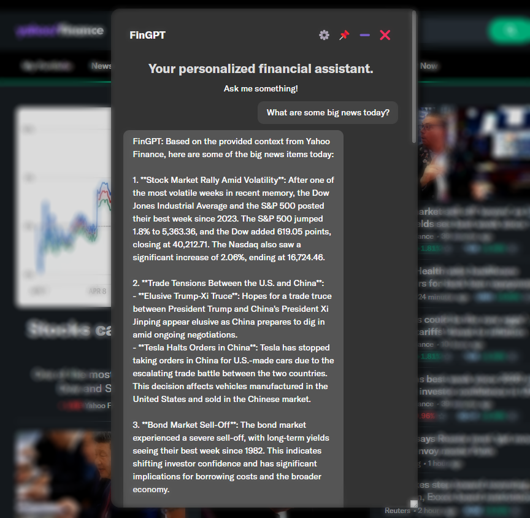
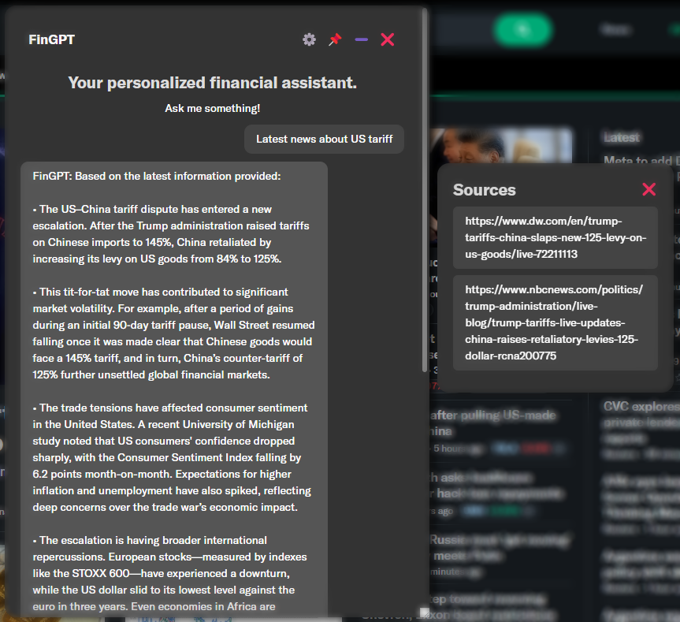

# FinGPT Search Agents

Vision: A financial agent to assist users in information retrieval and data analysis. It provides the information sources of generated responses to help users evaluate the responses' quality.
 
This is a demo of FinLLM Leaderboard on HuggingFace's [Open Financial LLM Leaderboard](https://huggingface.co/spaces/TheFinAI/Open-Financial-LLM-Leaderboard).

1. A powerful agent for retrieving financial information across major finance websites (Yahoo Finance, Bloomberg, XBRL International).
2. A powerful answer engine: performs open search to quickly locate relevant financial information from various sources, such as websites, reports, filings, and databases
3. Users can check the sources of generated responses, ensuring reliability and accuracy.

**NO Trading Suggestions!**

Current Progress:

1. Snapshot of the search agent: drag, resize and minimize; Providing information on user's current page.
   

2. Checking sources, which are very important and help reduce misinformation.
   


## Installation

### Prerequisites

- **Python 3.12.x** (uv will download it automatically)
- **Node.js 18+**
- **Google Chrome** browser

### 🐳 Quick Start with Docker (Recommended)

Build and run everything with a single command.

```bash
# Clone the repository
git clone https://github.com/Open-Finance-Lab/FinGPT-Search-Agent.git
cd FinGPT-Search-Agent

# Copy backend environment template and add your API keys
cp Main/backend/.env.example Main/backend/.env
# Edit Main/backend/.env and add at least one API key (OPENAI_API_KEY, ANTHROPIC_API_KEY, or DEEPSEEK_API_KEY)

# Start everything with one command (first run builds the image)
docker compose up
```

The backend API will be available at http://localhost:8000

### Manual Backend Setup with uv (Optional)

Use this path if you want to run Django without Docker.

```bash
# Clone the repository
git clone https://github.com/Open-Finance-Lab/FinGPT-Search-Agent.git
cd FinGPT-Search-Agent

# Install backend dependencies with uv (Python 3.12)
cd Main/backend
uv sync --python 3.12 --frozen

# Install Playwright's Chromium once per machine
uv run playwright install chromium

# Start Django (no database migrations required)
uv run python manage.py runserver
```

For the browser extension, run once per environment:

```bash
cd Main/frontend
npm install
npm run build:full
```
### Post-Installation

1. **Configure API Keys (Required)**
   
   Edit `Main/backend/.env` (copied from `Main/backend/.env.example`) and add at least one:
   ```
   OPENAI_API_KEY=your-actual-openai-key
   ANTHROPIC_API_KEY=your-actual-anthropic-key
   DEEPSEEK_API_KEY=your-actual-deepseek-key
   ```
   
   **Note**: The server will refuse to start without at least one valid API key configured.

2. **Load Browser Extension**
   
   - Open Chrome and navigate to Extensions page → `chrome://extensions`
   - Enable Developer mode
   - Click "Load unpacked"
   - Select `Main/frontend/dist` folder

### Troubleshooting

- **"No API keys configured!"**: The server won't start without valid API keys in `Main/backend/.env`
- **Running locally**: Use `uv sync --python 3.12 --frozen` inside `Main/backend` to bootstrap dependencies.
- **Port 8000 in use**: Close other servers or continue anyway.
- **Non-English systems**: UTF-8 encoding is automatically handled.
- **Playwright browser errors**: If you see browser-related errors, install Chromium:
  ```bash
  cd Main/backend
  uv run playwright install chromium
  ```
  See `Main/backend/PLAYWRIGHT_INTEGRATION.md` for detailed troubleshooting.

## Usage and Documentation

For detailed usage instructions and more information, see: https://fingpt-search-agent-docs.readthedocs.io/


Immediate Next Steps:
1. Deploy the back-end to cloud, further simplifying the installation process.

Future Plans:
1. zkp demo.

Citing:

```
@inproceedings{tian2024customized,
  title={Customized fingpt search agents using foundation models},
  author={Tian, Felix and Byadgi, Ajay and Kim, Daniel S and Zha, Daochen and White, Matt and Xiao, Kairong and Liu, Xiao-Yang},
  booktitle={Proceedings of the 5th ACM International Conference on AI in Finance},
  pages={469--477},
  year={2024}
}
```


**Disclaimer: We are sharing codes for academic purposes under the MIT education license. Nothing herein is financial 
advice, and NOT a recommendation to trade real money. Please use common sense and always first consult a professional
before trading or investing.**
